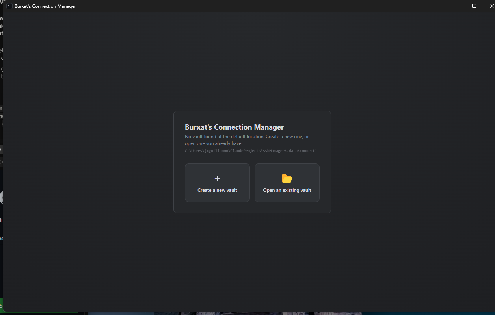
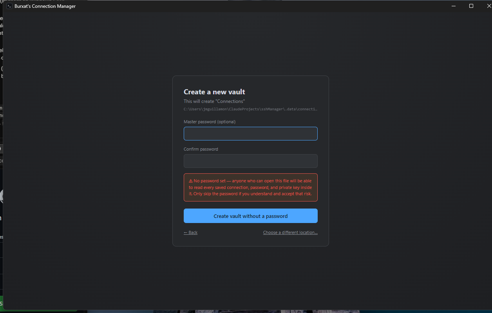
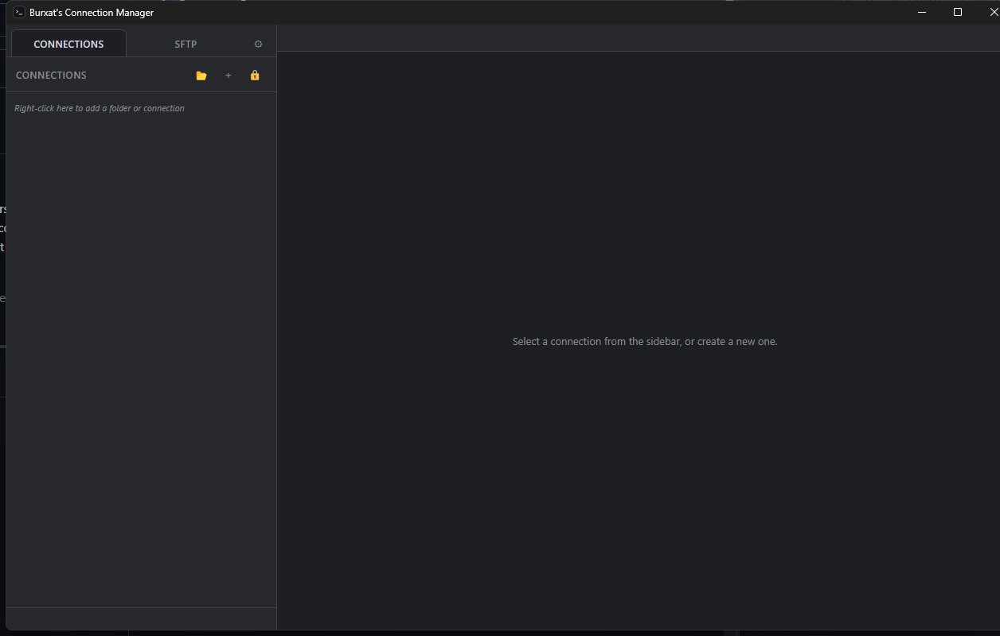
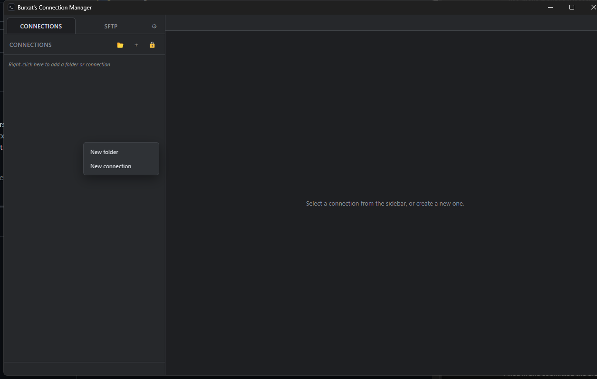
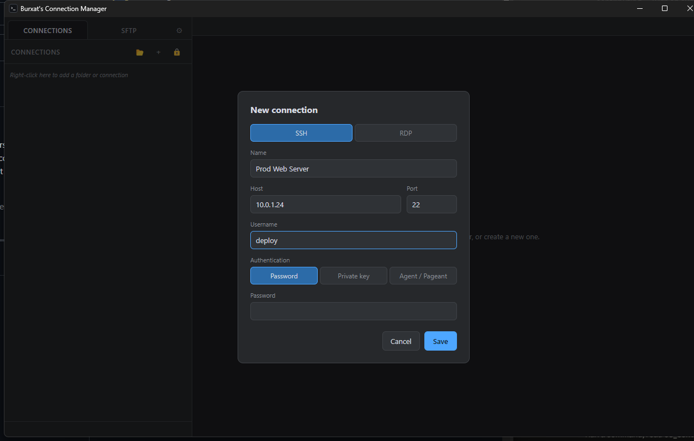
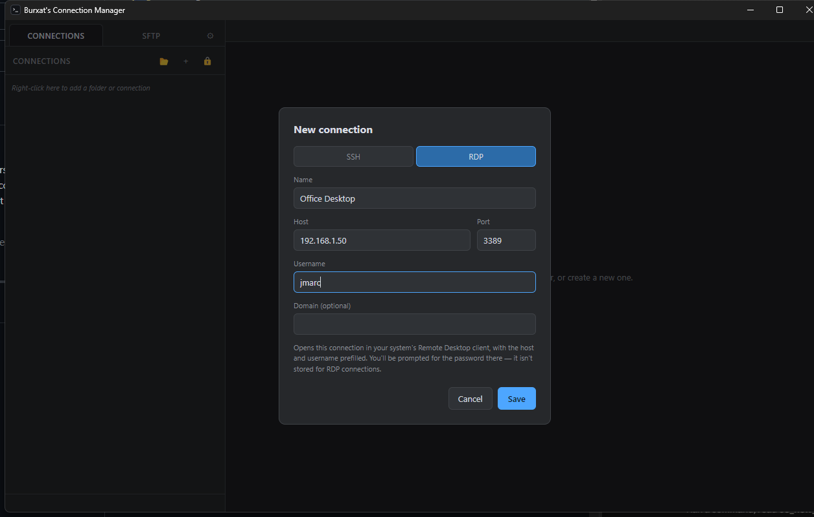
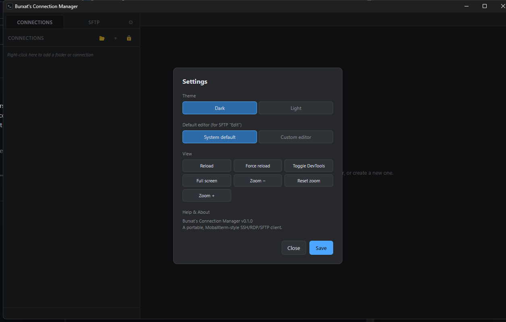

# Burxat's Connection Manager

**Free and open source, for anyone to use, study, modify, and share — see [License](#license).**

A portable connection manager built with Electron. It keeps a sidebar tree of folders and
connections, opens SSH sessions with a terminal + SFTP file browser side by side, and launches
RDP connections through your system's native Remote Desktop client — all backed by a single
encrypted vault file that travels with the app, not a fixed per-user profile path.

---

## Contents

- [Features](#features)
- [Screenshots](#screenshots)
- [Download](#download)
- [Getting started](#getting-started)
- [Usage guide](#usage-guide)
- [How the vault works](#how-the-vault-works)
- [Portability](#portability)
- [RDP support](#rdp-support)
- [Terminal features](#terminal-features)
- [Development](#development)
- [Architecture](#architecture)
- [Project layout](#project-layout)
- [Building distributable binaries](#building-distributable-binaries)
- [Security notes](#security-notes)
- [Known limitations](#known-limitations)
- [Contributing](#contributing)
- [License](#license)

---

## Features

- **Folder tree of connections** — organize SSH and RDP connections into nested folders, drag
  and drop to reorganize, right-click to create/rename/delete.
- **SSH sessions** with a real terminal ([xterm.js](https://xtermjs.org/)) and an SFTP file
  browser open side by side per connection tab.
- **Flexible SSH authentication**: password, private key (OpenSSH format or PuTTY `.ppk`,
  optionally passphrase-protected), or an SSH agent (Pageant on Windows, `ssh-agent` on
  Linux/macOS via `SSH_AUTH_SOCK`).
- **Private keys can be imported into the vault** so the whole setup — connections, credentials,
  and keys — travels with the app, not just references to files that may not exist on another
  machine.
- **RDP connections** open through your OS's native Remote Desktop client (`mstsc` on Windows,
  `xfreerdp` on Linux) with host/username prefilled.
- **SFTP file operations**: browse, upload, download, rename, delete, create folders, copy
  (server-side, no round trip through the client), copy-to-another-folder, and resizable/
  reorderable columns.
- **Edit remote files in your own editor**: pick "Edit" on a file, it downloads to a temp
  location, opens in your default (or a custom-configured) editor, and re-uploads automatically
  on every save — closing the editor ends the session.
- **Live server stats** (CPU/RAM) shown in the status bar while an SSH session is connected,
  polled over a separate exec channel — works against both Linux/Unix (`/proc`) and Windows
  (`wmic`/PowerShell CIM) targets.
- **Terminal quality-of-life**: right-click anywhere to paste the clipboard, select text to copy
  it automatically — no separate copy/paste menu needed.
- **Multiple vaults** — keep entirely separate, separately-password-protected sets of
  connections (e.g. "work" vs "personal"), switch between them, or point the app at a vault file
  anywhere on disk.
- **Fully portable** — copy the app folder (or the release zip) anywhere, including a USB drive;
  the encrypted vault is created next to the executable, not in a fixed OS profile path.
- **No telemetry, no network calls except to the hosts you connect to.** See
  [Security notes](#security-notes).

## Screenshots

| | |
| --- | --- |
|  *First launch — no vault found, choose to create or open one* |  *Password is optional — skipping it shows a clear warning* |
|  *Main window with an empty vault* |  *Right-click the sidebar to add a folder or connection* |
|  *New connection — SSH tab* |  *New connection — RDP tab* |
|  *Settings: theme, default editor, view controls* | |

## Download

Grab the latest build from the
[Releases](https://github.com/Joanmarcgs/BurxatConnectionManager/releases) page, or build from
source yourself (see [Getting started](#getting-started)).

| Platform | Artifact                                                              |
| -------- | ---------------------------------------------------------------------- |
| Windows  | `BurxatConnectionManager-<version>-portable.zip` — unzip, then run the `.exe` at the root |
| Linux    | `BurxatConnectionManager-<version>.tar.gz` — extract (`tar xzf ...`), then run `./burxat-connection-manager` from inside the extracted folder |

No installer, no admin rights, nothing written outside the folder you put it in.

## Getting started

Requirements: [Node.js](https://nodejs.org/) 18+ and npm.

```bash
git clone https://github.com/Joanmarcgs/BurxatConnectionManager.git
cd BurxatConnectionManager
npm install
npm run dev
```

The app always tries to reopen the last vault you used. **On first launch — or any time that
last-used vault file can't be found** (a fresh install, a moved/renamed app folder, a deleted
file, a different machine) — it falls back to its default vault location next to the executable
and, finding nothing there either, shows two big buttons instead of a password form:

> **Create a new vault** &nbsp;/&nbsp; **Open an existing vault**

- **Create a new vault** creates a brand-new encrypted vault at the default location (or
  anywhere else, via *Choose a different location…*). A master password is asked for but is
  **optional** — leaving it blank shows a clear warning that anyone who can open that file will
  be able to read every saved connection, password, and private key inside it, but the app will
  let you proceed if you accept that trade-off.
- **Open an existing vault** lets you browse to a `.vault` file you already have (e.g. copied
  over from another machine) and unlock it.

Once a vault exists at the current path, launching the app instead prompts:

> **Enter the master password for "connections.vault"**

If that vault was created with a password, enter it to unlock. If it was created without one,
just leave the field blank and submit. There's no password-recovery option for password-protected
vaults — if it's forgotten, that vault's contents are unrecoverable by design (see
[How the vault works](#how-the-vault-works)). You can also open a different vault file, or create
a new one at a location of your choosing, from the sidebar header at any time.

## Usage guide

- **Add a folder or connection**: right-click anywhere in the sidebar (or on an existing folder)
  → *New folder* / *New connection*.
- **New connection dialog**: choose the **SSH** or **RDP** tab at the top. SSH exposes
  host/port/username plus an authentication method (password, private key, or agent). RDP
  exposes host/port/username/domain — the password is entered in the native RDP client when it
  connects, it isn't stored.
- **Connect**: double-click a connection, or right-click → *Connect*. SSH connections open a new
  tab with terminal + SFTP; RDP connections launch your system's Remote Desktop client.
- **Reorganize**: drag any folder or connection onto a folder to move it there.
- **SFTP pane**: navigate with double-click, use the toolbar for upload/download/new
  folder/delete, or right-click a file for rename/download/delete/copy/copy-to-folder/edit.
  Column widths are resizable and there's a "reset to default" control.
- **Edit a remote file**: right-click → *Edit*. It opens in your configured editor (see
  Settings); saving re-uploads it automatically; closing the editor ends the watch.
- **Settings** (gear icon): default editor for "Edit", light/dark theme, view controls (reload,
  DevTools, zoom, fullscreen — these replace what would normally be a native menu bar, which this
  app doesn't use).
- **Multiple vaults**: use the folder icon in the sidebar header to open a different vault file,
  or the "+" icon to create a new one at a location you choose. Each vault has its own (optional)
  master password.

## How the vault works

All connections, credentials, and imported key material live in a single file,
`connections.vault`, encrypted with **AES-256-GCM**. The encryption key is derived from your
master password with **scrypt** (`N=2^15, r=8, p=1`) and a random 16-byte salt stored alongside
the ciphertext. The master password itself is never written to disk — only the derived key is
ever held in memory, and only while the vault is unlocked.

The vault file's format (plain JSON, base64-encoded fields) is intentionally simple:

```json
{ "salt": "...", "iv": "...", "authTag": "...", "ciphertext": "..." }
```

There is no password recovery mechanism — if you lose the master password, the vault's contents
are unrecoverable by design.

**The master password is optional.** The app will let you create a vault with an empty password
(with a clear warning at creation time) — the vault file is still AES-256-GCM encrypted with a
key derived the same way, just from an empty password, which offers essentially no protection
against anyone who can read the file. Only do this if you understand and accept that trade-off,
e.g. on a machine only you have access to.

## Portability

The app resolves where to store `connections.vault` in this order:

1. `PORTABLE_EXECUTABLE_DIR` — set by the Windows portable launcher, points at wherever you
   unzipped the app.
2. The directory containing the running `.AppImage` on Linux.
3. The directory of the packaged executable, as a fallback.
4. A `.data/` folder under the project root in development.

This means you can move the entire app folder (Windows zip contents, or the `.AppImage` file on
Linux) to another machine or a USB drive and your connections, keys, and settings come with it —
nothing is written to `%APPDATA%`, `~/.config`, or similar fixed OS locations.

The Windows distribution is a small native launcher `.exe` at the root plus an `app/` folder
holding the real Electron app — this avoids the multi-second self-extraction delay of a
traditional NSIS "portable" `.exe`, which re-unpacks its full payload on every single launch.

## RDP support

There is no in-app RDP renderer — implementing the full RDP protocol is out of scope for this
project. Instead, connecting to an RDP entry generates a temporary `.rdp` file (host, port,
username, domain) and hands it to your OS's native client:

- **Windows**: `mstsc.exe`
- **Linux**: `xfreerdp` (must be installed separately)
- **macOS**: opened via `open`, which hands it to whatever app is registered for `.rdp` files

The password is deliberately **not** included in the generated file — you'll be prompted for it
by the native client. This avoids ever writing an RDP password to disk, even temporarily.

## Terminal features

- **Right-click anywhere to paste** the current clipboard contents into the session.
- **Select text to copy it** to the clipboard automatically — no keyboard shortcut or menu
  needed.
- Clipboard access is routed through Electron's `clipboard` module in the main process (not the
  renderer's `navigator.clipboard`), so it works reliably regardless of the app's sandboxing.

## Development

```bash
npm install       # install dependencies
npm run dev       # start in development mode with hot reload
npm run typecheck # type-check main, preload, and renderer
npm run build     # production build (renderer/main/preload) into out/
npm run start     # preview a production build
```

## Architecture

Built with [Electron](https://www.electronjs.org/) + [electron-vite](https://electron-vite.org/)
+ React + TypeScript. Electron's process split is used deliberately for security:

- **Main process** (`src/main/`) — owns every SSH/SFTP connection ([ssh2](https://github.com/mscdex/ssh2)),
  the encrypted vault, RDP launching, clipboard access, and file-system access. Nothing here is
  reachable directly from the page.
- **Preload script** (`src/preload/`) — the *only* bridge between the two, exposing a narrow,
  typed `window.api` surface via `contextBridge`. No Node integration is exposed to the page.
- **Renderer** (`src/renderer/`) — the React UI. Runs with `contextIsolation: true`,
  `sandbox: true`, `nodeIntegration: false`; it can only do what the preload API explicitly
  allows.

All communication between renderer and main goes through a typed IPC contract defined in
`src/shared/ipc.ts` (channel name constants) and `src/shared/types.ts` (payload shapes), so the
preload API and the main-process handlers can't silently drift out of sync with each other.

## Project layout

```
src/
  main/            Electron main process
    ssh/             SSH/SFTP session management, key parsing, Pageant agent, edit-in-app,
                      stats polling
    rdp.ts            Native RDP client launcher
    secureStore.ts     Encrypted vault read/write
    vaultPath.ts       Portable data-directory resolution
    settingsStore.ts   App settings persistence
  preload/         contextBridge API exposed to the renderer
  renderer/        React UI
    src/components/   Sidebar, connection dialog, session view (terminal + SFTP), settings, etc.
    src/state/        zustand stores (vault, sessions, settings, SFTP UI state)
  shared/          IPC channel constants + types shared between main and renderer
build/             App icon, Windows launcher source (Launcher.cs)
scripts/           Windows portable-zip build script
```

## Building distributable binaries

```bash
npm run dist:win             # Windows portable zip: launcher exe + app/ folder, into dist/
npm run dist:linux           # Linux tar.gz, into dist/
npm run dist:linux:appimage  # Linux AppImage — only works when run on an actual Linux host, see below
```

`dist:win` builds an unpacked Electron app via `electron-builder --win dir`, compiles a small C#
launcher stub (via the .NET Framework's built-in `csc.exe` — no extra toolchain needed) that
starts the real app instantly without NSIS's self-extraction step, and zips the two together.

There's also `npm run dist:win:nsis` for a traditional NSIS-style portable `.exe`, kept mainly
for comparison — it's slower to launch (self-extracts on every run) and not the recommended
distribution format.

`dist:linux` produces a `tar.gz` rather than an AppImage by default — see
[Known limitations](#known-limitations) for why.

## Security notes

- **No telemetry.** The app makes no network calls of its own — the only network traffic it ever
  generates is the SSH/SFTP/RDP connections you explicitly initiate to hosts you configure.
- **Nothing leaves your machine.** The vault, keys, and settings are stored only on disk, next to
  the app.
- **The vault is only as strong as your master password.** Use a long, unique one — scrypt makes
  brute-forcing slower, but it can't make a weak password safe.
- **RDP passwords are never stored or written to disk**, even temporarily (see
  [RDP support](#rdp-support)).
- Please report security issues by opening a
  [GitHub issue](https://github.com/Joanmarcgs/BurxatConnectionManager/issues) — this is a
  community project without a dedicated security contact, so treat sensitive reports accordingly
  until a private disclosure channel exists.

## Known limitations

- RDP is launched via the OS's native client, not rendered in-app.
- No password-recovery mechanism for a forgotten master password, by design (only relevant if
  you set one — see [How the vault works](#how-the-vault-works)).
- Windows and Linux are actively packaged; macOS works in development but doesn't currently have
  a packaged build target.
- **The Linux release ships as `tar.gz`, not `AppImage`.** electron-builder's AppImage packaging
  tool is itself distributed with real POSIX symlinks inside its archive, which Windows' 7-Zip
  cannot extract — with or without admin rights — so it can't be built from a Windows host, which
  is what this project is currently built and released from. Building an AppImage on an actual
  Linux machine or in Linux-based CI should work fine; contributions to add that are welcome.

## Contributing

Issues and pull requests are welcome from anyone — this project is open source specifically so
other people can use it, adapt it, and improve it. A few pointers:

1. `npm run typecheck` and a manual smoke test (`npm run dev`) before opening a PR.
2. Keep changes focused — small, reviewable PRs are much easier to merge than large ones.
3. If you're proposing a larger feature, opening an issue to discuss it first is appreciated but
   not required.

## License

This project is licensed under the **[MIT License](LICENSE)** — one of the most permissive open
source licenses available. In short: **anyone is free to use, copy, modify, merge, publish,
distribute, sublicense, and even sell copies of this software**, for any purpose, commercial or
not, as long as the original copyright notice and license text are included. It comes with no
warranty. See the [`LICENSE`](LICENSE) file for the full legal text.
